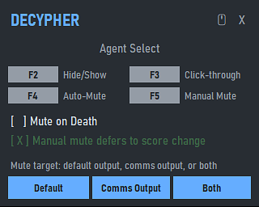
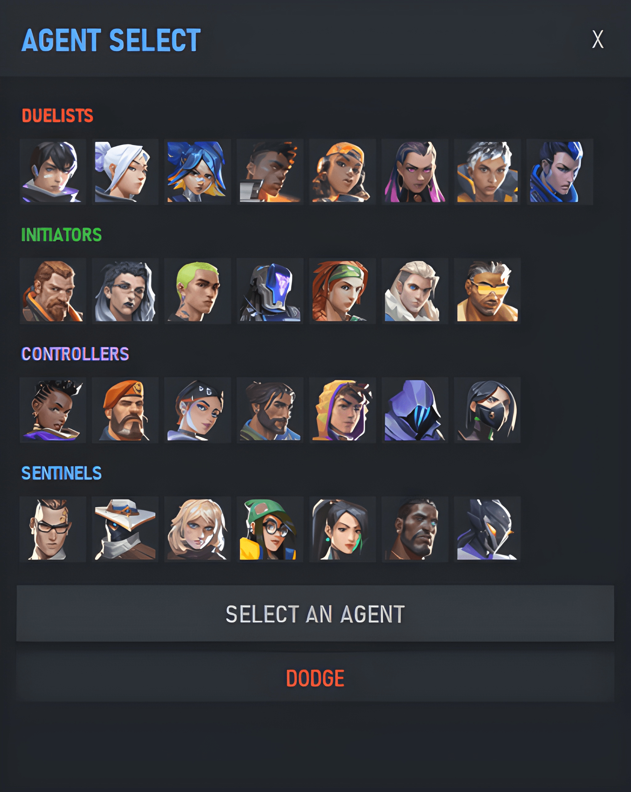

# decypher

QoL VALORANT overlay due to recent UI updates, focusing on two features:
- Mute on Death: mute the whole Valorant audio session once killed, then unmute on new round. Accounts for Clove ult, but NOT Sage revive.
- Agent select actions: select, instalock, and dodge.

`scripts/dragnscroll.ahk` is included for drag-to-scroll behavior to restore what UI changes stole: ability to scroll match history and friend list via `M2`. It is only ever active while VALORANT is running, focused, and not in a live match, so your `M2` is never hijacked. Requires AutoHotkey v2 to be installed. If `M2` is somehow ever hijacked, kill the script with `Ctrl+Alt+Backspace`.

---

<table>
  <tr>
    <td width="50%" align="center"><strong>Mute overlay</strong></td>
    <td width="50%" align="center"><strong>Agent select overlay</strong><br>(screenshot butchered by AI upscale)</td>
  </tr>
  <tr>
    <td width="50%" align="center">
      
    </td>
    <td width="50%" align="center">
      
    </td>
  </tr>
</table>

---

## Requirements

- Windows
- Valorant in borderless windowed mode
- Python 3.10+ for source installs

## Installation

```powershell
pip install -r requirements.txt
python overlay.py
```

or

```bat
install.bat
```

Alternatively, run `install_exe.bat` from the release zip.

## Controls (configurable)

- `F2`: toggle overlay visibility while in match.
- `F3`: toggle click-through mode.
- `F4`: toggle Mute on Death.
- `F5`: toggle manual mute.

## Uninstall

```bat
uninstall.bat
```

or delete the decypher shortcut from:

```text
%APPDATA%\Microsoft\Windows\Start Menu\Programs\Startup
```

## Notes

Not affiliated with Riot Games. Flaggable? Don't know.

Not Overwolf-based so some edge cases may slip through but I tried to handle all of them.
